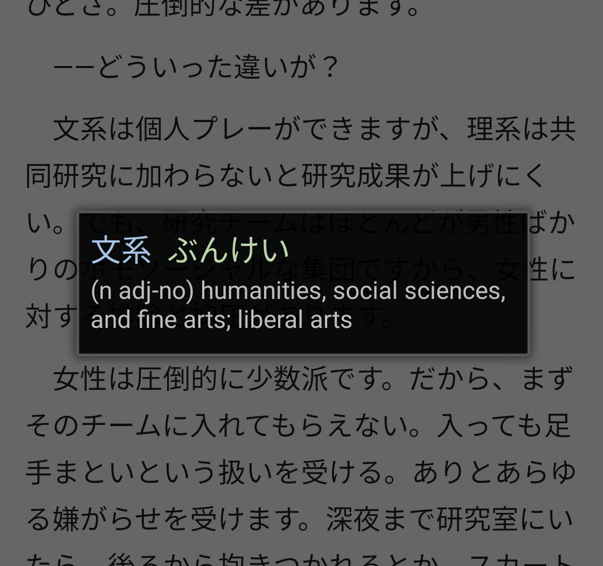

# Wakari-chan

Japanese screen-overlay dictionary for Android, based on [Yomichan](https://foosoft.net/projects/yomichan/).

Wakari-chan is [available in the Play Store](https://play.google.com/store/apps/details?id=org.furidamu.wakari_chan) for easy installation.

## Screenshot

